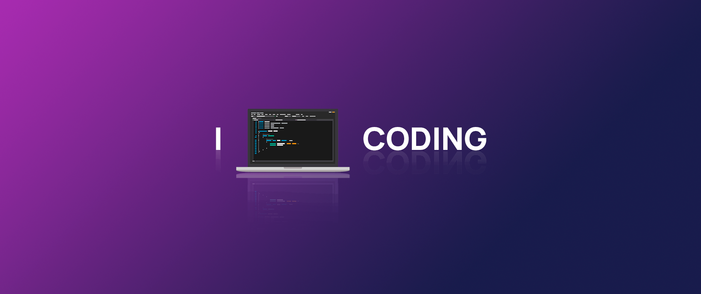

  <h3 align="center">السلام عليكم ورحمة الله وبركاته</h3>
  
I'm **Hasibur Rahman Fahim**, a frontend developer with a passion for creating delightful user interfaces. Welcome to my GitHub profile!

 
  <table><tr><td valign="top" width="33%">

   <h2 align="center"> Skills </h2>

### Languages:
 
  
    
    
    
    
    

### Frontend:  
  
  
  
  
  
  
  
  
  
  
  
  
  
  
  
  
  
  
  
  
  
  
  
  

### Languages:
 
  
    
    
     
    

</td></tr></table>  

### 📞Connect:
  
  
  

  <h3 align="center">LIFE RUNS ON CODE </h3>
  

 

  

     

<!--  -->

