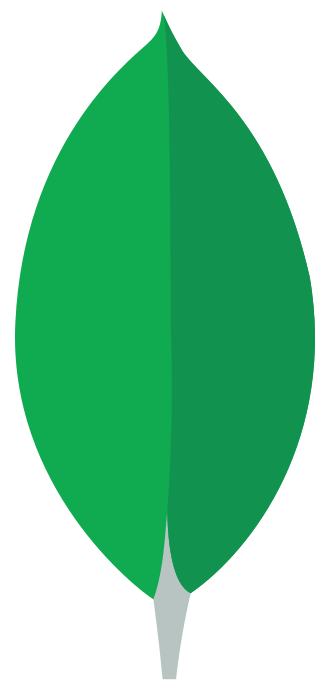

  <h3 align="center">السلام عليكم ورحمة الله وبركاته</h3>
  
I'm **Hasibur Rahman Fahim**, a frontend developer with a passion for creating delightful user interfaces. Welcome to my GitHub profile!

 
 <h2 font="bold" align="center">SKILLS</h2>
</td><td valign="top" width="33%">
   
  
  

 
  
    
    
    
    

         
           
 

  
  
   
    
     
    
         
      
      
       
         
         
         
         
         
         
         
         
         
         
         
           

         
    

 
  
    
    

</td></tr></table>  
  
 
  <h3  align="center">- CONTACTS -</h3>
  
 
    
   
  
  
  
  
   

  
  

      

  <h3 align="center">LIFE RUNS ON CODE </h3>
  

    
    <!--       -->
  

<!--  -->

